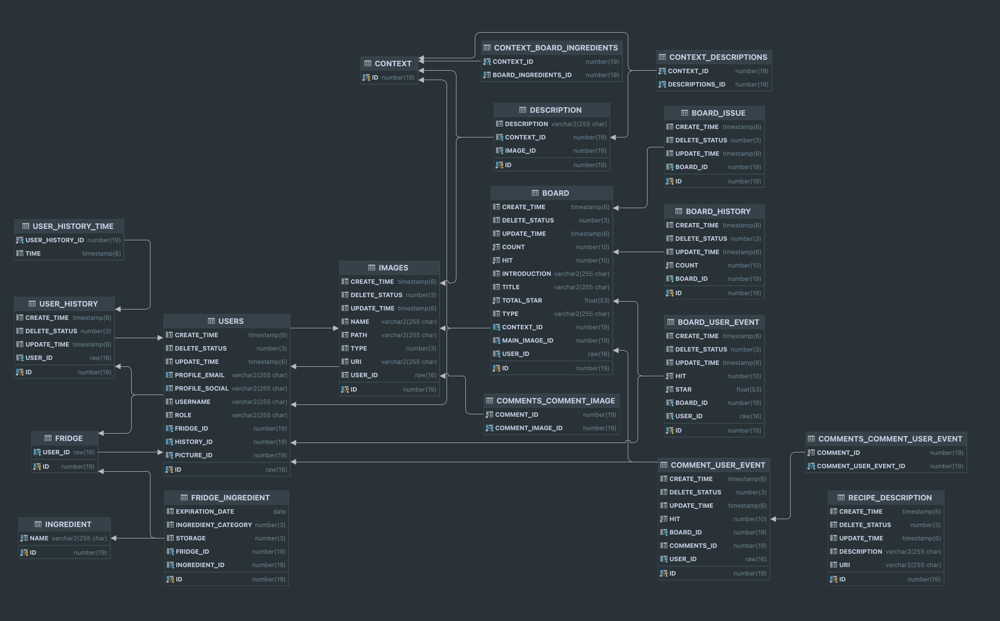

## fridge chef - 나만의 냉장고 셰프

## 프로젝트 개요
### 팀명 : fridge chef
- 제작 기간 : 2024.08.22 ~ 2024.(개발중)

### 냉장고 안에 재료로 레시피를 만들 수 있어요 
- 안쓰는 재료로 만들 수 있는 레시피를 조회
- 나만의 레시피를 만들어 사람들과 공유
- 사용자 편의성을 고려하여 UI 제작

### 팀원 소개

| [강정훈](https://github.com/JHKoder) | [신민기](https://github.com/ABCganada) | [김민영](https://github.com/alsendrha) | 이서인  |
|:-----------------------:|:-----------------------------------:|:-----------------------------------:|:----:|
|  |  | |         |
| 백엔드  |  백엔드 |  앱 |  디자이너   |

# 백엔드 사용 기술 및 아키텍처

## skill

- java,spring boot,jpa,rest doc

## dev
- oracle cloud Interface
  - server cpu 3, memory 16
  - dev cpu1, memory 6
  - cloud Object Storage
  - database oracle 19c
- cloudflare dns
- git

## 빌드 및 배포 전략
- git action 

## 커밋 규칙
- 브랜치명 : feat,fix,refactor,bug,test 
- 메세지 :브랜치 명 or gitmoji 방식

## ERD

## 개발 환경 분리 

- local 환경은 어느 곳 에서나 실행 가능 
- dev,prod 환경은 Jasypt password 암호 필요

# 프로젝트 소개 

## 냉장고 

## 레시피북

## 커뮤니티

