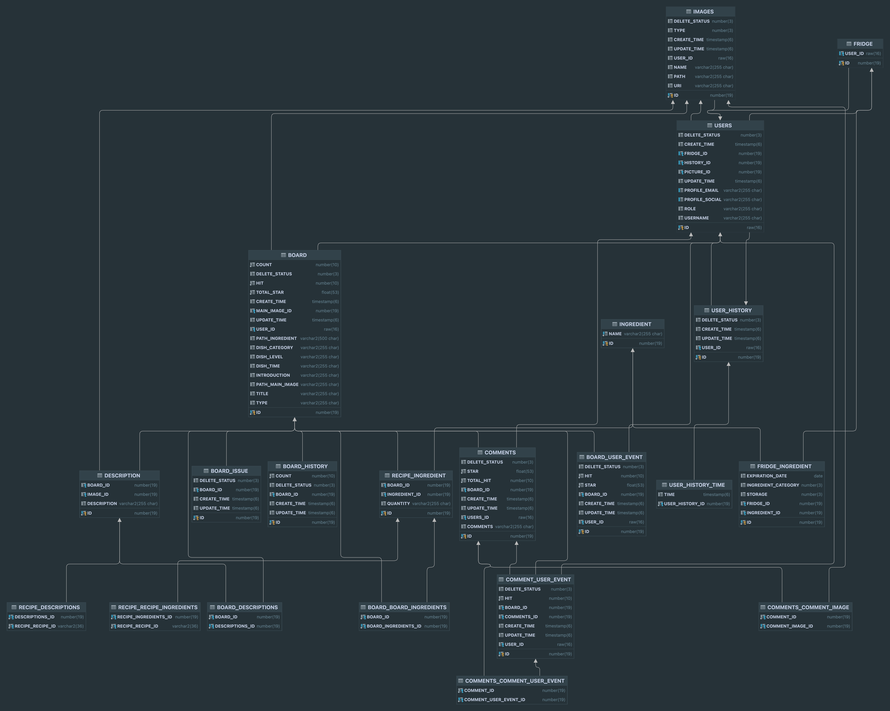

## fridge chef - 나만의 냉장고 셰프

---

## 프로젝트 개요

### 팀명 : fridge chef

- 제작 기간 : 2024.08.22 ~ 2024.(개발중)

[메인 이미지 제작중]

## 소개

### 냉장고 안에 재료로 레시피를 만들 수 있어요

- 안쓰는 재료로 만들 수 있는 추천 레시피 제공
- 나만의 레시피를 만들어 사람들 과 공유
- 사용자 편의성을 위주로 개발

### 팀원 소개

| [강정훈](https://github.com/JHKoder) | [신민기](https://github.com/ABCganada) | [김민영](https://github.com/alsendrha) | 이서인  |
|:-----------------------:|:-----------------------------------:|:-----------------------------------:|:----:|
|  |  | |         |
| 백엔드  |  백엔드 |  앱 |  디자이너   |

# 백엔드 사용 기술 및 아키텍처

## 빌드 및 실행 방법

1. 프로젝트 클론
   ```bash
   git clone https://github.com/Fridge-Chef/FridgeChef_BE.git
   ```
2. Gradle로 빌드
   ```bash
   ./gradlew build
   ```
3. 실행
   ```bash
   ./gradlew bootRun
   ```

#### 실행 조건

- local = 어디에서나 가능
- dev = resources/private 폴더 내 img,key 파일 필요
- prod = 서버외 실행 불가능

## 사용 기술 & 환경

- **언어**: Java 17
- **프레임워크**: Spring Boot 3.3
- **ORM**: JPA, QueryDsl
- **테스트**: REST Docs & Junit
- **CI/CD**: Git Actions
- **서버**: Oracle Cloud
    - cpu 3, memory 16
- **이미지 저장소**: Oracle Cloud Object Storage
- **DB**:
    - prod :Oracle Cloud oracle 19c
    - local,dev : h2
- **DNS**: cloudflare dns

## REST-DOC & Redocly API 문서

[API DOCS](https://fridgebe.site/docs.html)

## 커밋 규칙

- 브랜치명 : feat,fix,refactor,bug,test
- 메세지 :브랜치 명 or gitmoji 방식

## 개발 환경 분리

- local
    - 어느 곳 에서나 실행 가능
- dev
    - Jasypt password 암호 필요
    - resources/private 폴더 내 priv,pub,config,pem 파일 필요
- prod
    - 실 서버용 .p12 , db 연결 tns 파일, 암호 키 필요,

## ERD



# 기여도

|      도메인      | 강정훈(기여도) | 신민기(기여도) |
|:-------------:|:-------:|:--------:|
|      유저       |   100%  |    -     |
|      재료       |   40%   |   60%    |
|      냉장고      |   40%   |   60%    |
|      레시피      |   90%   |   10%    |
|      게시판      |   100%  |    -     |
|      댓글       |   100%  |    -     |
|  게시글, 댓글 이벤트  |   100%  |    -     |
|      이미지      |   100%  |    -     |
|  서버 빌드 및 배포   |   100%  |    -     |
| 레시피 데이터 초기화 |   20%   |   80%    |
|               |   |          |
|  프로젝트 총 기여도   |   79%   |   21%    |

## 유스케이스

---

### 서비스 이용

